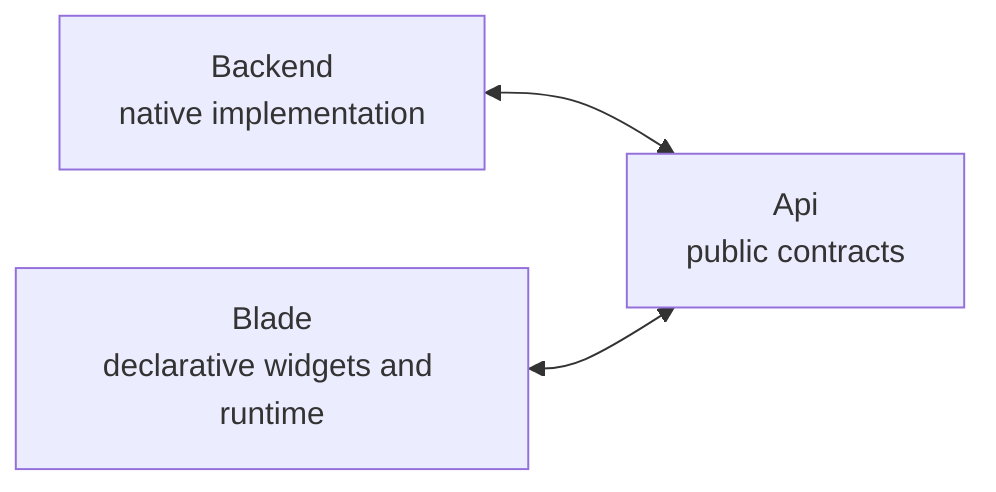
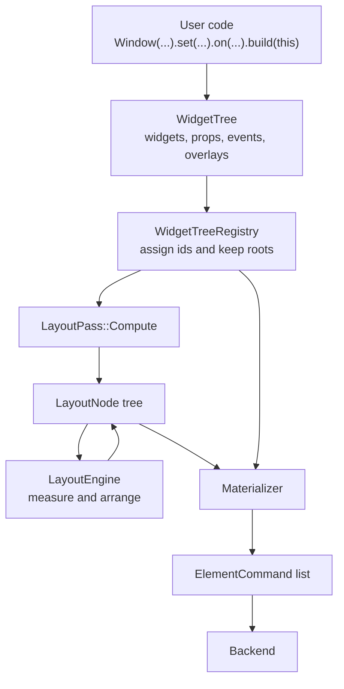
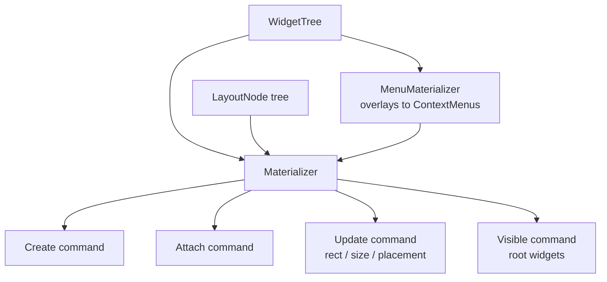
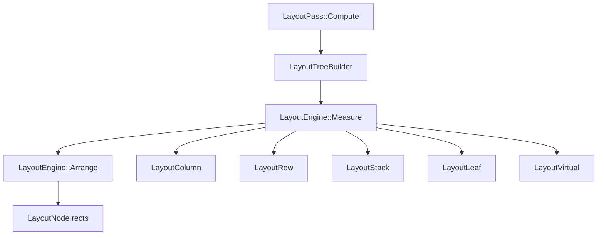

# Architecture

Blade is split into three main modules:

## Modules

- `Api` contains shared public contracts: commands, messages, props, events, and common data types.
- `Blade` contains user-facing widgets and runtime logic that converts widget trees into layout and backend commands.
- `Backend` contains native implementation details and executes commands through WinAPI.

## Runtime Flow

## Materializer

## Layout Engine

