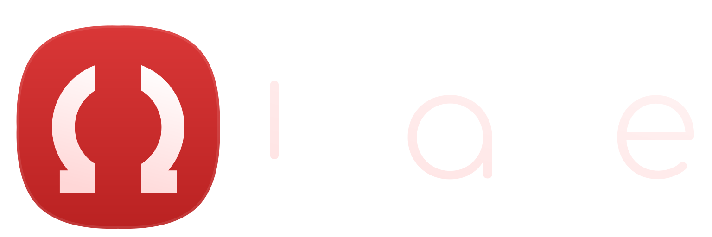

# Blade 


 


<p align="center">

</p>

> [!NOTE]
> 
> _Super_ **Fast** _Super_ **Small** _Super_ **Simple** _Super_ **Buggy**
> 
> C++ **Declarative** UI Library 
> 
> Based on **WinAPI** from *Hell*
> 

> [!IMPORTANT]
> 
> This code written with **LLM** assistance
> 

```c++
#include "blade.h"
#include "App/AppBackend.h"

using namespace Blade;

class Sandbox : public App
{
protected:
    auto onSetup() -> void override
    {
        use<Backend::AppBackend>();
    }

    auto onCreate() -> void override
    {
        Window(
            Button(L"Quit").on({ .click = [] { App::Quit(); } })
        ).set({
            .title = L"Hello Blade",
            .size = {400, 200},
            .placement = Api::WindowPlacement::Center()
        }).mount();
    }
};

auto main() -> int
{
    Sandbox app;
    return app.run();
}
```

## Content

<details>
<summary>Show navigation</summary>

- [Application](#application)
- [Runtime UI Commands](#runtime-ui-commands)
- [Syntax](#syntax)
- [Root Widgets](#root-widgets)
  - [Window](#window)
    - [Window Properties](#window-properties)
    - [Window Events](#window-events)
    - [WindowPlacement Factories](#windowplacement-factories)
  - [Tray](#tray)
    - [Tray Properties](#tray-properties)
- [Controls](#controls)
  - [Button](#button)
    - [Button Properties](#button-properties)
    - [Button Events](#button-events)
- [Menu](#menu)
  - [Menu Separator](#menu-separator)
  - [Submenu](#submenu)
  - [Menu Properties](#menu-properties)
  - [MenuTrigger Values](#menutrigger-values)
  - [MenuItem Properties](#menuitem-properties)
  - [Shortcut Factories](#shortcut-factories)
- [Layout](#layout)
  - [Column](#column)
  - [Row](#row)
  - [Stack](#stack)
  - [Column and Row Properties](#column-and-row-properties)
  - [Stack Properties](#stack-properties)
  - [Layout Properties](#layout-properties)
  - [Alignment Values](#alignment-values)

</details>

## Application

Blade apps inherit from `Blade::App`. Use `onSetup()` to select a backend and `onCreate()` to create root widgets.

`App` owns application lifecycle. `App::Quit()` stops the application message loop and can be called from callbacks.

## Runtime UI Commands

Use `UI` to send runtime commands to already mounted UI elements by id.

```c++
auto windowId = Window(...).mount();
auto trayId = Tray(...).mount();

UI::Show(windowId);
UI::Hide(windowId);
UI::Unmount(windowId);

UI::Window::Close(windowId);
UI::Window::Minimize(windowId);
UI::Window::Maximize(windowId);
UI::Window::Restore(windowId);

UI::Tray::Icon(trayId, L"app.ico");
UI::Tray::Title(trayId, L"Blade");
```

`Show`, `Hide`, and `Unmount` are generic UI commands. Window-only and tray-only commands live in `UI::Window` and `UI::Tray`.

## Syntax

Widget properties are configured with `.set(...)`.

```c++
Button(L"Run").set({
    .size = {120, 40}
})
```

Widget events are configured with `.on(...)`.

```c++
Button(L"Quit").on({
    .click = [] { App::Quit(); }
})
```

Root widgets are attached to the app runtime with `.mount()`.

```c++
Window(Button(L"Quit")).mount();
Tray(Menu(MenuItem(L"Exit"))).mount();
```

## Root Widgets

### Window

```c++
Window(
    Button(L"Close").on({ .click = [] { App::Quit(); } })
).set({
    .title = L"Window",
    .size = {800, 600},
    .placement = Api::WindowPlacement::Center(),
    .minSize = {320, 240}
}).on({
    .close = [] { return true; }
}).mount();
```

<a id="window-properties"></a>
<details>
<summary>Supported <code>WindowProps</code></summary>

| Property | Type | Default | Example |
| --- | --- | --- | --- |
| `title` | `Api::Text` | `L"Blade"` | `L"Settings"` |
| `icon` | `Api::Text` | empty | `L"app.ico"` or `L"app.png"` |
| `size` | `Api::Size` | `{800, 600}` | `{1024, 768}` |
| `visible` | `bool` | `true` | `false` |
| `resizable` | `bool` | `true` | `false` |
| `topMost` | `bool` | `false` | `true` |
| `taskbar` | `bool` | `true` | `false` |
| `minSize` | `Api::Size` | `{0, 0}` | `{320, 240}` |
| `maxSize` | `Api::Size` | `{0, 0}` | `{1920, 1080}` |
| `caption` | `Api::CaptionProps` | visible, all buttons | `{ .visible = false }` |
| `placement` | `Api::WindowPlacementProps` | `Api::WindowPlacement::Default()` | `Api::WindowPlacement::Center({0, 0}, 1)` |
| `state` | `Api::WindowState` | `Normal` | `Api::WindowState::Maximized` |
| `lifetime` | `Api::Lifetime` | `Owner` | `Api::Lifetime::Ignore` |

</details>

<a id="window-events"></a>
<details>
<summary>Supported <code>WindowEvents</code></summary>

| Event | Callback |
| --- | --- |
| `close` | return `false` to cancel close |
| `drop` | receives dropped file paths as text |

</details>

<a id="windowplacement-factories"></a>
<details>
<summary><code>WindowPlacement</code> factories</summary>

```c++
Api::WindowPlacement::Manual({100, 100})
Api::WindowPlacement::Center()
Api::WindowPlacement::TopLeft()
Api::WindowPlacement::TopRight()
Api::WindowPlacement::TopFill()
Api::WindowPlacement::LeftFill()
Api::WindowPlacement::Fill()
```

Most placement factories accept offset and monitor index:

```c++
Api::WindowPlacement::Center({20, 0}, 1)
```

</details>

### Tray

`Tray` creates a system tray icon. It can be used without any windows.

```c++
Tray(
    Menu(
        MenuItem(L"Open").on({ .click = [] { LOG(L"Open"); } }),
        MenuItem(L"Exit").on({ .click = [] { App::Quit(); } })
    ).set({ .trigger = Api::MenuTrigger::LeftRight })
).set({
    .title = L"Blade",
    .icon = L"app.ico"
}).mount();
```

<a id="tray-properties"></a>
<details>
<summary>Supported <code>TrayProps</code></summary>

| Property | Type | Default | Example |
| --- | --- | --- | --- |
| `title` | `Api::Text` | `L"Blade"` | `L"Blade Tray"` |
| `icon` | `Api::Text` | empty | `L"app.ico"` or `L"app.png"` |
| `lifetime` | `Api::Lifetime` | `Owner` | `Api::Lifetime::Ignore` |

</details>

## Controls

### Button

```c++
Button(L"Run").set({
    .size = {120, 40},
    .isDefault = true
}).on({
    .click = [] { LOG(L"Clicked"); },
    .drop = [](Api::Text files) { LOGF_D(L"Drop:\n%s", files.c_str()); }
})
```

<a id="button-properties"></a>
<details>
<summary>Supported <code>ButtonProps</code></summary>

| Property | Type | Default | Example |
| --- | --- | --- | --- |
| `layout` | `Api::LayoutProps` | default layout | `{ .flex = 1 }` |
| `size` | `Api::Size` | `{100, 50}` | `{120, 40}` |
| `isDefault` | `bool` | `false` | `true` |

</details>

<a id="button-events"></a>
<details>
<summary>Supported <code>ButtonEvents</code></summary>

| Event | Callback |
| --- | --- |
| `click` | no arguments |
| `focus` | returns bool |
| `drop` | receives dropped file paths as text |

</details>

## Menu

Menus are attached through `ContextArea`, `Tray`, or other widgets that support context menus.

```c++
ContextArea(
    Button(L"File"),
    Menu(
        MenuItem(L"Open").on({ .click = [] { LOG(L"Open"); } }),
        MenuItem(L"Exit").set({
            .shortcut = Api::Shortcut::Ctrl(L'Q')
        }).on({ .click = [] { App::Quit(); } })
    ).set({ .trigger = Api::MenuTrigger::RightClick })
)
```

### Menu Separator

```c++
Menu(
    MenuItem(L"Open").on({ .click = [] { LOG(L"Open"); } }),
    MenuSeparator(),
    MenuItem(L"Exit").on({ .click = [] { App::Quit(); } })
)
```

### Submenu

```c++
Menu(
    MenuItem(L"Export",
        MenuItem(L"PNG").on({ .click = [] { LOG(L"PNG"); } }),
        MenuItem(L"PDF").on({ .click = [] { LOG(L"PDF"); } })
    )
)
```

<a id="menu-properties"></a>
<details>
<summary>Supported <code>MenuProps</code></summary>

| Property | Type | Default | Example |
| --- | --- | --- | --- |
| `trigger` | `Api::MenuTrigger` | `RightClick` | `Api::MenuTrigger::LeftRight` |

</details>

<a id="menutrigger-values"></a>
<details>
<summary>Supported <code>MenuTrigger</code> values</summary>

| Value | Meaning |
| --- | --- |
| `None` | disabled |
| `LeftClick` | left mouse button |
| `MiddleClick` | middle mouse button |
| `RightClick` | right mouse button |
| `LeftRight` | left or right mouse button |
| `All` | left, middle, or right mouse button |

</details>

<a id="menuitem-properties"></a>
<details>
<summary>Supported <code>MenuItemProps</code></summary>

| Property | Type | Default | Example |
| --- | --- | --- | --- |
| `shortcut` | `Api::Shortcut` | `Api::Shortcut::None()` | `Api::Shortcut::Ctrl(L'Q')` |

</details>

<a id="shortcut-factories"></a>
<details>
<summary><code>Shortcut</code> factories</summary>

```c++
Api::Shortcut::None()
Api::Shortcut::Ctrl(L'Q')
Api::Shortcut::Alt(L'X')
Api::Shortcut::Shift(L'F')
```

Currently shortcuts are displayed in the native menu. Keyboard handling is not implemented yet.

</details>

## Layout

### Column

```c++
Column(
    Button(L"Top"),
    Button(L"Bottom")
).set({
    .gap = 8,
    .mainAxisAlignment = MainAxisAlignment::Center,
    .crossAxisAlignment = CrossAxisAlignment::Stretch
})
```

### Row

```c++
Row(
    Button(L"One"),
    Button(L"Two").set({ .layout = { .flex = 1 } })
).set({
    .gap = 8,
    .crossAxisAlignment = CrossAxisAlignment::Center
})
```

### Stack

```c++
Stack(
    Button(L"Back"),
    Button(L"Front")
)
```

<a id="column-and-row-properties"></a>
<details>
<summary>Supported <code>ColumnProps</code> and <code>RowProps</code></summary>

| Property | Type | Default | Example |
| --- | --- | --- | --- |
| `gap` | `int` | `0` | `8` |
| `layout` | `Api::LayoutProps` | default layout | `{ .padding = {8} }` |
| `mainAxisAlignment` | `MainAxisAlignment` | `Start` | `MainAxisAlignment::Center` |
| `crossAxisAlignment` | `CrossAxisAlignment` | `Stretch` | `CrossAxisAlignment::Center` |

</details>

<a id="stack-properties"></a>
<details>
<summary>Supported <code>StackProps</code></summary>

| Property | Type | Default | Example |
| --- | --- | --- | --- |
| `layout` | `Api::LayoutProps` | default layout | `{ .padding = {8} }` |

</details>

<a id="layout-properties"></a>
<details>
<summary>Supported <code>Api::LayoutProps</code></summary>

| Property | Type | Default | Example |
| --- | --- | --- | --- |
| `margin` | `Api::Thickness` | `{}` | `{8}` |
| `padding` | `Api::Thickness` | `{}` | `{4, 8, 4, 8}` |
| `flex` | `int` | `0` | `1` |

</details>

<a id="alignment-values"></a>
<details>
<summary>Supported alignment values</summary>

```c++
MainAxisAlignment::Start
MainAxisAlignment::Center
MainAxisAlignment::End
MainAxisAlignment::SpaceBetween
MainAxisAlignment::SpaceAround
MainAxisAlignment::SpaceEvenly

CrossAxisAlignment::Start
CrossAxisAlignment::Center
CrossAxisAlignment::End
CrossAxisAlignment::Stretch
```

</details>
